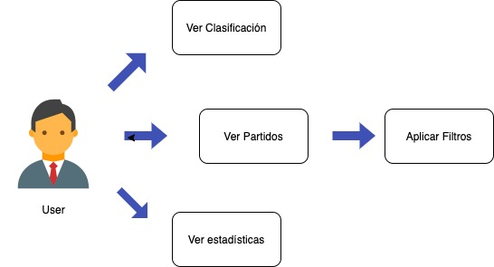

# La liga App v1.0

 Proyecto La_Liga es una App que nos sirve para estar al día de todo lo relacionado con la Liga Española de fútbol. En ella podemos encontrar: clasificación, resultados. próximos partios, estadísticas...

 ## Descripción Funcional

Las características principales de la app son las siguientes:

- Visualización de todos los partidos de la temporada.

- Visualización de todos los resultados.

- Visualización de la clasificación.

- Visualización de estadísticas (top5).

### Casos de uso

Aquí añadimos nuestro diagramas de casos de uso, con su actor y las elipses que simbolizan los casos:

## Descripción Técnica
- getMatches(): recibe un array y construye una tabla de manera dinámica con los resultados.

- La funcion getErrorFiltro() nos crea un mensaje en el cual nos dice que para poder hacer un filtradro de equipo, debe estar escrito bien el nombre. Al escribir dicho nombre de forma incorrecta, nos elimina todos los elementos de la tabla. Para ello, hacemos la llamada de esta función dentro de la función FiltrarPorNombre().

 ## Tecnologías

 - HTML
 - CSS (Bootstrap)
 - Vanilla JS

 ## Versiones

 v1.1 Añadido ligas extranjeras (25/02/21)

 ## TO-DO

  - Reestructuración de tablas.

  - Mejoras de los radio buttons.

  - v1.1 Añadido ligas extranjeras (25/02/21)